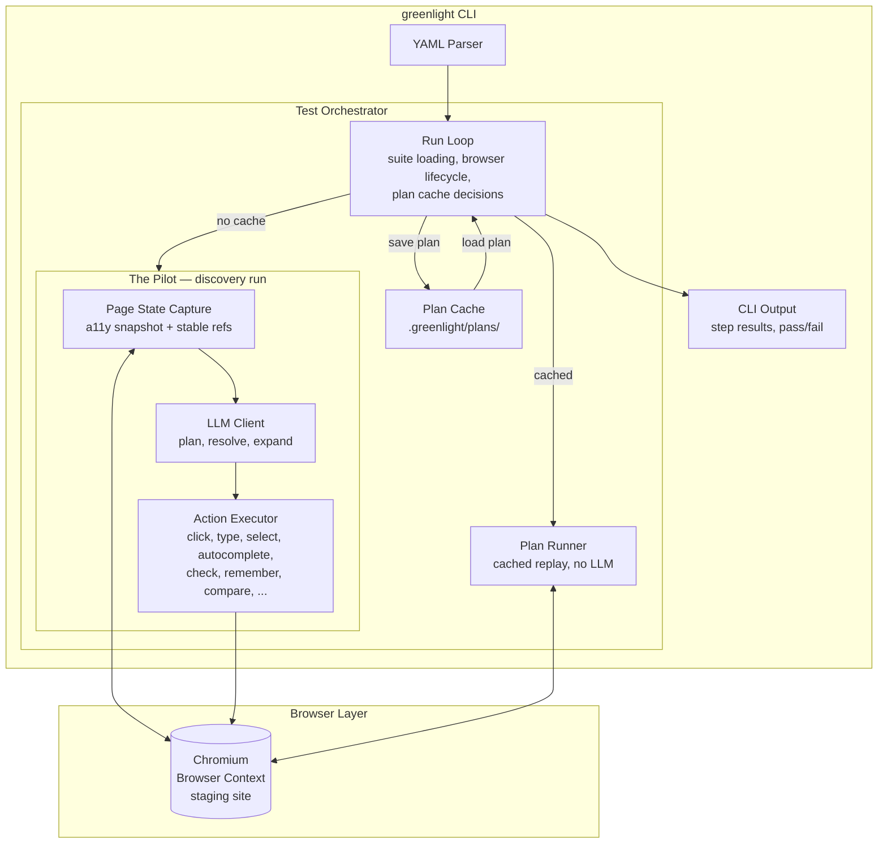

<p align="center">
  
</p>

# GreenLight

Natural language driven end-to-end testing for web applications. Write tests as plain-English user stories, and an AI agent (the Pilot) executes them against your staging environment using a real browser.

No selectors. No XPaths. No test IDs, drivers or glue code. Just describe what a user would do.

---

**[How it works](#how-it-works)** | **[Quick start](#quick-start)** | **[Project configuration](#project-configuration)** | **[CLI](#cli)** | **[Test syntax](#test-syntax)** | **[Writing test steps](#writing-test-steps)** | **[Cached plans](#cached-plans)** | **[LLM setup](#llm-setup)** | **[Architecture](#architecture)** | **[Avoiding side effects](#avoiding-side-effects-in-your-app)** | **[CI/CD](#cicd)**

---

## How it works

```yaml
suite: "Product Search"

tests:
  - name: "Filtering reduces results"
    steps:
      - navigate to Products from the main menu
      - remember the number of results shown
      - select "Electronics" in the category filter
      - check that the number of results has decreased
      - search for "wireless headphones"
      - check that the page contains "wireless"
      - fill in the inquiry form with email "test@example.com" and some test data
      - submit the form
      - check that you see "Thanks for your inquiry"
```

GreenLight understands form wizards, custom dropdowns, autocomplete fields, checkbox consent flows, complex date pickers and interactive maps. It fills in forms with realistic test data, handles before/after value comparisons, and works with any UI framework.

The first run uses the LLM Pilot to discover the right actions (the **pilot** run). 
After that, GreenLight caches a concrete action plan and replays it without LLM calls — making subsequent runs fast and deterministic.

## Quick start

1. Add GreenLight to your project:

```bash
npm install @eidra-umain/greenlight
```

2. Create a `greenlight.yaml` in your project root:

```yaml
suites:
  - tests/e2e/login.yaml
  - tests/e2e/checkout.yaml

deployments:
  staging:
    base_url: https://staging.myapp.com

provider: openrouter
model:
  planner: anthropic/claude-sonnet-4.6
  pilot: openai/gpt-4o-mini

```

3. Add an `LLM_API_KEY` for your chosen provider using a `.env` file or an environment variable.
3. Run:

```bash
greenlight run --pilot --headed
```

## Project configuration

GreenLight looks for a `greenlight.yaml` in the working directory. This file defines which suites to run and supports multiple deployment targets.

### Single deployment

When there is only one deployment, it is used automatically:

```yaml
suites:
  - tests/e2e/*.yaml

deployments:
  staging:
    base_url: https://staging.myapp.com
```

### Multiple deployments

```yaml
suites:
  - tests/e2e/*.yaml

model: anthropic/claude-sonnet-4
timeout: 15000

deployments:
  dev:
    base_url: https://dev.myapp.com
  staging:
    base_url: https://staging.myapp.com
  prod:
    base_url: https://myapp.com
    timeout: 30000

default_deployment: staging
```

Shared settings go at the top level. Deployment-specific settings override them.

```bash
greenlight run                  # uses default_deployment (staging)
greenlight run -d prod          # selects the prod deployment
greenlight run -d dev           # selects the dev deployment
```

If there are multiple deployments and no `default_deployment` is set, the `--deployment` flag is required.

### All config fields

| Field | Type | Description |
|-------|------|-------------|
| `suites` | string[] | Paths or globs to suite YAML files (required) |
| `deployments` | map | Named deployment targets |
| `default_deployment` | string | Which deployment to use by default |
| `base_url` | string | Base URL for the site under test (in deployments or top-level config) |
| `model` | string | LLM model identifier |
| `llm_base_url` | string | Base URL for the OpenAI-compatible API |
| `timeout` | number | Per-step timeout in milliseconds |
| `headed` | boolean | Run browser in visible mode |
| `parallel` | number | Number of concurrent test cases |
| `reporter` | string | Output format: `cli`, `json`, or `html` |
| `viewport` | object | `{ width, height }` for the browser viewport |

All fields except `suites` can appear at the top level or inside a deployment. Priority: **CLI flags > deployment > top-level config > built-in defaults**.

## CLI

```bash
greenlight run [suites...]              # run suite YAML files (overrides greenlight.yaml)
greenlight run                          # run suites from greenlight.yaml
greenlight run -d, --deployment <name>  # select a named deployment
greenlight run -t, --test <name>        # filter by test name
greenlight run --base-url <url>         # override base URL
greenlight run --headed                 # visible browser
greenlight run -p, --parallel 4         # concurrent test cases
greenlight run -r, --reporter json      # json output (also: cli, html)
greenlight run -o, --output results.json  # write to file
greenlight run --timeout 15000          # per-step timeout (ms)
greenlight run --model openai/gpt-4o    # override LLM model
greenlight run --llm-base-url <url>     # use a different OpenAI-compatible API
greenlight run --debug                  # verbose output (actions, LLM modes, timings)
greenlight run --trace                  # timestamped browser events for perf analysis
greenlight run --pilot                  # force pilot (LLM) run, ignore cached plans
greenlight run --plan-status            # show cache status for all tests
greenlight run --on-drift rerun         # re-run with pilot on cached plan drift (default: fail)
```

## GreenLight philosophy compared to Gherkin/Cucumber

Traditional BDD tools like Cucumber use **Gherkin** — a structured `Given/When/Then` syntax where every step requires a developer-written **step definition** (glue code) that maps the English phrase to actual browser automation with CSS selectors or XPaths.

GreenLight takes a different approach:

| | GreenLight | Gherkin (Cucumber) |
|---|---|---|
| **Test language** | Freeform plain English | Structured `Given/When/Then` keywords |
| **Element targeting** | AI resolves via accessibility tree — no selectors | Developers write glue code with selectors/XPaths |
| **Maintenance** | Tests survive UI refactors that don't change behavior | Selector changes break tests, requiring glue code updates |
| **Authoring** | Non-technical testers, no code required | Readable specs, but developers must write step definitions |
| **Determinism** | Cached plans are deterministic; discovery runs have LLM variability | Fully deterministic — same input, same execution path |
| **Maturity** | New, LLM-dependent | Battle-tested (15+ years), broad ecosystem |

**In short:** Gherkin requires developers to bridge English and browser automation via step definitions. GreenLight uses AI as that bridge — eliminating the glue code layer at the cost of introducing LLM-dependent variability.

## Test syntax

Tests are plain English. The Pilot interprets intent, so phrasing is flexible. Quick reference:

| Action | Example |
|--------|---------|
| Navigate | `go to "/products"` or `navigate to About from the menu` |
| Click | `click "Add to Cart"` or `click the Submit button` |
| Scroll | `scroll down`, `scroll to top`, or `scroll to the footer` |
| Type | `enter "jane@example.com" into "Email"` |
| Select | `select "Canada" from "Country"` (works with native and custom dropdowns) |
| Form fill | `fill in the contact form with email "a@b.com" and some test data` |
| Autocomplete | `type "Stock" into the city field and select the first suggestion` |
| Check | `check the "I agree to terms" checkbox` |
| Random data | `name the booking a random string` |
| Date/time | `set the start time to 10 minutes from now` |
| Count | `count the number of product cards` |
| Remember | `remember the number of search results` |
| Compare | `check that the number of results is less than before` |
| Assert remembered | `check that the booking we just created is visible` |
| Viewport check | `check that "Contact Form" is in the viewport` |
| Assert | `check that page contains "Order Confirmed"` |
| Conditional | `if "Accept cookies" is visible, click it` |
| Map assert | `check that the map shows "Stockholm"` or `check that zoom level is at least 10` |
| Multi-step | `Select Red - Green - Blue in the color picker` (auto-split into 3 clicks) |

See **[Writing test steps](#writing-test-steps)** below for detailed guidance on each action type, including form filling, value comparisons, conditionals, map testing, and reusable steps.

## Writing test steps

This section covers how GreenLight interprets your plain-English steps, what happens behind the scenes, and how to write steps that work reliably.

### How steps are processed

When you write a step like `click the "Add to Cart" button`, GreenLight's **planner** (an LLM) converts it into a structured action before any browser interaction happens. Understanding this pipeline helps you write clearer steps:

1. **Planning** — the LLM reads all your steps and classifies each one into an action type
2. **Execution** — the pilot executes each action against the live browser page
3. **Caching** — successful runs are saved so future runs skip the LLM entirely

### Navigation

Navigate to pages by URL or by describing what to click:

```yaml
steps:
  - go to "/products"                        # direct URL navigation
  - navigate to "https://example.com/about"  # full URL
  - navigate to About from the main menu     # click a link (uses the live page)
```

**Tip:** Use quoted paths starting with `/` or `http` for direct navigation. For anything that requires finding and clicking a link, describe it naturally — GreenLight will resolve it against the live page.

### Clicking and interacting

```yaml
steps:
  - click "Add to Cart"                # click a button or link by text
  - click the Submit button            # natural description
  - press Enter                        # keyboard key
  - scroll down                        # page scrolling
```

When you put text in quotes, GreenLight looks for an element with that exact text. Without quotes, it interprets the description more loosely against the accessibility tree.

### Scrolling

```yaml
steps:
  - scroll down                              # scroll the page down
  - scroll up                                # scroll the page up
  - scroll to top                            # jump to the top of the page
  - scroll to bottom                         # jump to the bottom of the page
  - scroll to the "Contact us" section       # scroll a specific element into view
  - scroll to the footer                     # scroll to a described element
```

`scroll up` and `scroll down` move the page by a fixed amount (like pressing Page Down). `scroll to top` and `scroll to bottom` jump directly to the start or end of the page. When you describe a specific element, GreenLight finds it in the accessibility tree and scrolls it into view.

#### Viewport assertions

After scrolling, you can verify that an element is (or isn't) visible in the current viewport:

```yaml
steps:
  - scroll to the "Contact" section
  - check that "Contact Form" is in the viewport
  - check that the "Hero Banner" is not in the viewport
```

This checks the element's position relative to the browser window, not just DOM visibility. An element can exist on the page and be "visible" in the DOM sense, but still be off-screen at the current scroll position. The `in the viewport` assertion verifies it's actually on screen.

### Typing and form fields

```yaml
steps:
  - enter "jane@example.com" into "Email"    # type into a specific field
  - type "Stockholm" into the search field   # natural field description
```

GreenLight types character-by-character to trigger JavaScript event handlers (autocomplete, validation, etc.), just like a real user.

### Dropdowns and selects

```yaml
steps:
  - select "Canada" from "Country"           # works with native <select> and custom dropdowns
```

A single `select` step handles both opening the dropdown and choosing the option — don't split it into two steps.

### Autocomplete fields

```yaml
steps:
  - type "Stock" into the city field and select the first suggestion
  - type "New" into the city field and select "New York"
```

GreenLight detects autocomplete fields and handles the type-wait-select flow automatically. Specify which suggestion to pick, or default to the first.

### Checkboxes

```yaml
steps:
  - check the "I agree to terms" checkbox
  - uncheck the "Newsletter" checkbox
```

Use `check`/`uncheck` instead of `click` for checkboxes — this ensures correct toggle behavior for both native and custom checkbox implementations.

### Form filling

For entire forms, describe what to fill and GreenLight inspects the actual form fields to generate appropriate test data:

```yaml
steps:
  - fill in the contact form with email "test@example.com" and some test data
  - fill in the registration form and submit it
```

At runtime, GreenLight reads the form's field labels, placeholders, input types, and required status, then generates realistic data for each field. Explicitly mentioned values (like the email above) are used exactly. Autocomplete fields are detected and handled with type-wait-select flows. Consent checkboxes are automatically checked.

### Multi-step interactions

When a step describes multiple sequential actions, separate them with dashes:

```yaml
steps:
  - Select Red - Green - Blue in the color picker   # three sequential clicks
```

Each value becomes a separate click action. Use this for tabs, radio cards, multi-select UIs — anything where you're clicking multiple items in sequence.

### Assertions

Any step starting with "check that" or "verify" is treated as an assertion — it validates page state without interacting:

```yaml
steps:
  # Text presence (most common)
  - check that the page contains "Order Confirmed"
  - check that the page does not contain "Error"

  # URL checks
  - check that the URL contains "/success"

  # Element visibility
  - check that "Welcome back" is visible
  - check that the error message is not visible

  # Element state
  - verify that the "Submit" button is disabled
  - verify that the "Submit" button is enabled

  # Numeric comparisons
  - check that the count of products is greater than 0
  - verify there are at least 5 results
```

**Important:** Assertions with quoted text (like `"Order Confirmed"`) are resolved at plan time — no LLM call needed at runtime. Assertions without quotes (like `check that the form is present`) require the live page to resolve.

### Random test data

When a step asks to type "a random string", "some test data", or similar, the pilot generates a realistic random value and types it. This is useful for creating unique records in tests:

```yaml
steps:
  - name the booking a random string
  - enter a random email into the "Email" field
  - fill the "Description" field with some test data
```

For full forms with multiple fields, use the form filling syntax (`fill in the form with some test data`) — GreenLight inspects each field's label, type, and placeholder to generate appropriate data.

### Date and time pickers

GreenLight has built-in support for date/time pickers — including native HTML5 inputs and component-library widgets like MUI DateTimePicker with sectioned spinbuttons. No special syntax is needed; just describe what time to set using natural language:

```yaml
steps:
  - set the start time to 10 minutes from now
  - set the end time to 1 hour from now
  - set the deadline to tomorrow at 3pm
  - set the check-in date to next Monday
  - enter 2026-06-15 in the date field
```

**How it works:**

1. The planner identifies date/time steps and extracts the time expression (e.g., "10 minutes from now")
2. [chrono-node](https://github.com/wanasit/chrono) parses the expression into an exact timestamp — no LLM needed for time math
3. GreenLight inspects the page's accessibility tree to find the picker elements
4. Values are filled into the correct fields automatically

**Supported picker types:**

- **Native HTML5** (`<input type="date">`, `datetime-local`, `time`) — filled with `YYYY-MM-DD`, `YYYY-MM-DDTHH:mm`, or `HH:mm`
- **Sectioned pickers** (MUI v7, etc.) — individual spinbutton sections (Day, Month, Year, Hours, Minutes) are each filled with the correct value
- **Multiple pickers on one page** — GreenLight matches "start" / "end" in the step text against picker group names to target the right one

**Supported time expressions:**

| Expression | Example result |
|-----------|---------------|
| `10 minutes from now` | Current time + 10 minutes |
| `1 hour from now` | Current time + 1 hour |
| `tomorrow` | Tomorrow, same time |
| `tomorrow at 3pm` | Tomorrow at 15:00 |
| `next Monday` | The upcoming Monday |
| `2026-06-15` | Explicit date |
| `2026-06-15 14:30` | Explicit date and time |

Date picker steps are always computed fresh — even on cached plan replay, the timestamp is recalculated from the current time. This means tests with relative times like "10 minutes from now" never fail due to stale cached dates.

### Counting elements

Count the number of matching elements on the page and store the result for later comparison:

```yaml
steps:
  # Count and compare against a previous count
  - count the number of product cards
  - apply the "Electronics" filter
  - check that the number of product cards has decreased

  # Count and compare against a remembered value
  - remember the number of results shown
  - apply a filter
  - check that the number of product cards shown equals the remembered count

  # Count specific elements
  - count the number of "Add to Cart" buttons
  - count the number of rows in the results table
```

**How it works:** GreenLight inspects the live page's accessibility tree to identify all elements matching the description. The LLM determines a common denominator (role, text pattern, or accessible name) that uniquely identifies the target elements, then counts all matches using exact text matching to avoid false positives from headings or breadcrumbs. The count is stored as a number in the value store — the same mechanism used by `remember` — so it works seamlessly with `check that ... has decreased/increased` comparisons.

When a step checks that the number of visible elements equals a remembered value, GreenLight automatically splits it into a count + compare: first count the elements, then compare the count against the stored variable.

### Value comparisons (remember/compare)

Remember a value before an action, then compare after:

```yaml
steps:
  - remember the number of search results
  - apply the "In Stock" filter
  - check that the number of results has decreased
```

GreenLight captures the numeric value from the page, stores it, and compares it after the action. Supported operators: `increased`, `decreased`, `greater than`, `less than`, `equal to`, `at least`, `at most`.

You can also remember non-numeric values and check that they appear on the page later:

```yaml
steps:
  - name the booking a random string
  - remember the name of the booking
  - click "Save"
  - check that the booking we just created is visible in the list
```

This flow generates a random value, captures it, performs an action, and then verifies the value still appears on the page. Useful for testing create/edit/delete workflows where you need to verify that a specific record you just created shows up correctly.

### Conditional steps

Conditional steps let you handle pages that may look different between runs — cookie banners, feature flags, A/B tests, or optional UI elements.

#### Inline conditionals

Write the condition and action as a single step:

```yaml
steps:
  - if "Accept cookies" is visible, click it
  - click "Dismiss" if visible
  - if the page shows "Out of stock" then click "Notify me" else click "Add to cart"
  - if url contains "/login" then check that page contains "Sign in"
```

#### Block conditionals

For multi-step branches, use YAML structure:

```yaml
steps:
  - navigate to /home
  - if: cookie banner is visible
    then:
      - click "Accept all"
      - wait for the banner to disappear
    else:
      - check that the product list is visible
  - search for "headphones"
```

The `else` block is optional. Block conditionals are flattened to inline conditionals at load time — the planner and pilot handle them the same way.

#### Supported conditions

- **Visibility:** `if "text" is visible`, `if the page shows "text"`
- **Text presence:** `if page contains "text"`, `if the page shows "text"`
- **URL:** `if url contains "/path"`

If the condition is false and there's no `else`, the step is simply skipped (not failed). The test report shows which branch was taken: `[then]`, `[else]`, or `[skipped]`.

### Map testing

GreenLight has built-in support for testing interactive WebGL maps. When a step mentions maps, markers, layers, or zoom levels, GreenLight detects the map library, attaches to its instance, and queries rendered features directly — bypassing the DOM (WebGL canvas content is invisible to the accessibility tree).

```yaml
steps:
  - navigate to the map view
  - check that the map shows "Stockholm"
  - check that the zoom level is at least 10
  - check that the "hospitals" layer is visible on the map
```

Currently supported: **MapLibre GL JS**. The architecture is pluggable — Mapbox GL and Leaflet adapters can be added.

**How it works:** When a step mentions map-related content, GreenLight automatically inserts a map detection step. Map assertions query the actual rendered vector tile features (place names, road labels, etc.) and viewport state (center, zoom, bounds, layers) — not the DOM.

**Map instance detection** works automatically for most setups:

1. **React apps** (react-map-gl, etc.) — walks the React fiber tree
2. **Vue apps** — checks `__vue_app__` / `__vue__` component trees
3. **Global variables** — scans `window.map`, `window.mapInstance`, etc.
4. **Explicit exposure** — set `window.__greenlight_map = map` for maximum reliability

### Reusable steps

Define common sequences at the suite level and invoke by name:

```yaml
reusable_steps:
  log in as admin:
    - enter "{{admin_email}}" into "Email"
    - enter "{{admin_password}}" into "Password"
    - click "Sign In"

tests:
  - name: "Admin can access settings"
    steps:
      - log in as admin
      - click "Settings"
      - check that page contains "Account Settings"
```

### Tips for reliable tests

- **Be specific with quotes** — `click "Submit"` is more reliable than `click the submit button` because it matches exact text.
- **One action per step** — each step should describe one thing a user does. GreenLight splits compound steps, but explicit single-action steps are more predictable.
- **Use assertions liberally** — after key actions, add a `check that` step to verify the expected outcome. This catches failures early and makes the test report more readable.
- **Don't over-specify DOM structure** — say `click "Add to Cart"` not `click the button inside the product card div`. GreenLight uses the accessibility tree, not CSS selectors.
- **Conditional steps for flaky UI** — if a cookie banner or popup sometimes appears, use `click "Accept" if visible` instead of making it a required step.

## Cached plans

The first run of a test uses LLM calls to discover the right browser actions (**discovery run**). After a successful run, GreenLight caches the concrete action sequence as a **heuristic plan** in `.greenlight/plans/`.

Subsequent runs replay the cached plan directly via Playwright — no LLM calls, no API costs, significantly faster. If you change the test steps in YAML, the hash changes and GreenLight automatically re-discovers.

```bash
greenlight run                    # uses cached plans where available
greenlight run --pilot            # force pilot (LLM) run, ignore cache
greenlight run --plan-status      # show which tests have cached plans
```

## LLM setup

### API key

Set your API key via the `LLM_API_KEY` environment variable or a `.env` file in the project root:

```bash
LLM_API_KEY=sk-...
```

The same key is used regardless of provider. `OPENROUTER_API_KEY` is also accepted for backward compatibility.

### Providers

GreenLight supports four LLM providers with native API integrations:

| Provider | Value | API |
|----------|-------|-----|
| [OpenRouter](https://openrouter.ai) | `openrouter` (default) | Access all models through a single API |
| [OpenAI](https://platform.openai.com) | `openai` | GPT-4o, GPT-4o-mini, etc. |
| [Google Gemini](https://ai.google.dev) | `gemini` | Gemini 2.5 Flash, Pro, etc. |
| [Anthropic Claude](https://console.anthropic.com) | `claude` | Claude Sonnet, Haiku, etc. |

Set the provider in `greenlight.yaml` or via CLI:

```yaml
provider: openai
```

```bash
greenlight run --provider gemini
```

Only one provider is active at a time. OpenRouter is the default — it lets you access models from all vendors through a single API key, which is the easiest way to get started.

### Model selection

GreenLight uses the LLM in two distinct roles with different requirements:

- **Planner** — interprets the test steps, splits compound actions, and expands form-filling steps. This runs once per test case and benefits from a more capable model for consistent, correct results.
- **Pilot** — resolves individual steps against the live page (picking which element to click/type). This runs many times per test and should use a fast, inexpensive model to keep costs and execution time low.

Configure both in `greenlight.yaml`:

```yaml
provider: openrouter
model:
  planner: anthropic/claude-sonnet-4      # smarter model, runs once per test
  pilot: openai/gpt-4o-mini              # fast model, runs per step
```

Or use a single model for both roles:

```yaml
model: anthropic/claude-sonnet-4
```

The `--model` CLI flag sets both roles to the same model (useful for quick overrides):

```bash
greenlight run --model openai/gpt-4o
```

Model names must match the provider's naming convention:

| Provider | Example model names |
|----------|-------------------|
| OpenRouter | `anthropic/claude-sonnet-4`, `openai/gpt-4o-mini`, `google/gemini-2.5-flash` |
| OpenAI | `gpt-4o`, `gpt-4o-mini` |
| Gemini | `gemini-2.5-flash`, `gemini-2.5-pro` |
| Claude | `claude-sonnet-4-20250514`, `claude-haiku-4-20250514` |

### Custom LLM endpoint

Each provider has a default API endpoint. You can override it with `llm_base_url` for proxies, self-hosted models, or compatible APIs:

```yaml
# Local Ollama (OpenAI-compatible)
provider: openai
llm_base_url: http://localhost:11434/v1
model: llama3
```

```bash
greenlight run --provider openai --llm-base-url http://localhost:11434/v1 --model llama3
```

## Tech stack

| Layer | Technology |
|-------|-----------|
| Browser automation | Playwright (Chromium) |
| Page representation | Accessibility tree with stable element refs + map viewport state |
| AI | OpenRouter (any OpenAI-compatible provider) |
| Plan caching | SHA-256 hash-based invalidation, `.greenlight/plans/` |
| Test definitions | YAML |
| Language | TypeScript (Node.js, ESM) |

## Architecture



**Discovery run:** capture page state (a11y tree with stable refs) → LLM determines action → execute via Playwright → record for cache.

**Cached run:** replay stored actions directly via Playwright — no LLM calls, no API costs.

## Documentation

- [Specifications](docs/specifications.md) — full feature spec, technology decisions, MCP strategy
- [Implementation Plan](docs/implementation.md) — step-by-step build plan

## Avoiding side effects in your app

GreenLight provides two signals that your application can use to detect when it's running under a test and suppress side effects like analytics, chat widgets, cookie banners, or third-party scripts that interfere with testing.

### `window.__E2E_TEST__`

A global boolean set to `true` on every page before any app JavaScript runs. Use it in your frontend code:

```js
if (!window.__E2E_TEST__) {
  initAnalytics()
  loadIntercom()
  showCookieBanner()
}
```

### `X-E2E-Test` HTTP header

The header `X-E2E-Test: true` is sent on all same-origin requests (navigation, fetch, XHR). Use it server-side to skip side effects:

```js
// Express middleware example
app.use((req, res, next) => {
  if (req.headers['x-e2e-test'] === 'true') {
    req.isE2ETest = true
  }
  next()
})

// Skip sending emails during E2E tests
if (!req.isE2ETest) {
  await sendConfirmationEmail(order)
}
```

The header is only added to same-origin requests — cross-origin requests to CDNs, tile servers, and third-party APIs are not affected. This avoids triggering CORS preflight requests on external services.

## CI/CD

```yaml
- name: Run E2E tests
  run: greenlight run -d staging --reporter json --output results.json
  env:
    OPENROUTER_API_KEY: ${{ secrets.OPENROUTER_API_KEY }}
```

Exit code 0 on all-pass, non-zero on any failure.
