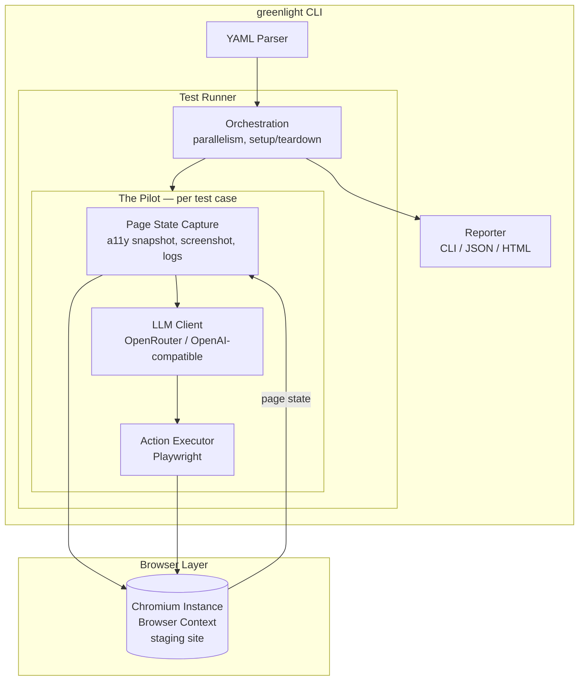

<p align="center">
  
</p>

# GreenLight

AI-driven end-to-end testing for web applications. Write tests as plain-English user stories, and an AI agent (the Pilot) executes them against your staging environment using a real browser.

No selectors. No XPaths. No test IDs. Just describe what a user would do.

## How it works

```yaml
suite: "Login Flow"
base_url: "https://staging.example.com"
variables:
  user_email: "jane@example.com"
  user_password: "{{env.TEST_PASSWORD}}"

tests:
  - name: "User can log in and see dashboard"
    steps:
      - enter "{{user_email}}" into "Email"
      - enter "{{user_password}}" into "Password"
      - click "Sign In"
      - check that page contains "Welcome back, Jane"
      - check that URL contains "/dashboard"
```

The Pilot reads each step, observes the page through accessibility tree snapshots (with screenshot fallback), determines the right browser action via an LLM, and executes it through Playwright.

## Quick start

1. Add GreenLight to your project:

```bash
npm install greenlight
```

2. Create a `greenlight.yaml` in your project root:

```yaml
suites:
  - tests/e2e/login.yaml
  - tests/e2e/checkout.yaml

deployments:
  staging:
    base_url: https://staging.myapp.com
```

3. Run:

```bash
greenlight run
```

## Project configuration

GreenLight looks for a `greenlight.yaml` in the working directory. This file defines which suites to run and supports multiple deployment targets.

### Single deployment

When there is only one deployment, it is used automatically:

```yaml
suites:
  - tests/e2e/*.yaml

deployments:
  staging:
    base_url: https://staging.myapp.com
```

### Multiple deployments

```yaml
suites:
  - tests/e2e/*.yaml

model: anthropic/claude-sonnet-4
timeout: 15000

deployments:
  dev:
    base_url: https://dev.myapp.com
  staging:
    base_url: https://staging.myapp.com
  prod:
    base_url: https://myapp.com
    timeout: 30000

default_deployment: staging
```

Shared settings go at the top level. Deployment-specific settings override them.

```bash
greenlight run                  # uses default_deployment (staging)
greenlight run -d prod          # selects the prod deployment
greenlight run -d dev           # selects the dev deployment
```

If there are multiple deployments and no `default_deployment` is set, the `--deployment` flag is required.

### All config fields

| Field | Type | Description |
|-------|------|-------------|
| `suites` | string[] | Paths or globs to suite YAML files (required) |
| `deployments` | map | Named deployment targets |
| `default_deployment` | string | Which deployment to use by default |
| `base_url` | string | Base URL for the site under test |
| `model` | string | LLM model identifier |
| `llm_base_url` | string | Base URL for the OpenAI-compatible API |
| `timeout` | number | Per-step timeout in milliseconds |
| `headed` | boolean | Run browser in visible mode |
| `parallel` | number | Number of concurrent test cases |
| `reporter` | string | Output format: `cli`, `json`, or `html` |
| `viewport` | object | `{ width, height }` for the browser viewport |

All fields except `suites` can appear at the top level or inside a deployment. Priority: **CLI flags > deployment > top-level config > built-in defaults**.

## CLI

```bash
greenlight run [suites...]              # run suite YAML files (overrides greenlight.yaml)
greenlight run                          # run suites from greenlight.yaml
greenlight run -d, --deployment <name>  # select a named deployment
greenlight run -t, --test <name>        # filter by test name
greenlight run --base-url <url>         # override base URL
greenlight run --headed                 # visible browser
greenlight run -p, --parallel 4         # concurrent test cases
greenlight run -r, --reporter json      # json output (also: cli, html)
greenlight run -o, --output results.json  # write to file
greenlight run --timeout 15000          # per-step timeout (ms)
greenlight run --model openai/gpt-4o    # override LLM model
greenlight run --llm-base-url <url>     # use a different OpenAI-compatible API
greenlight run --debug                  # verbose output (a11y tree, actions, timings)
```

## GreenLight philosopy compared to Gherkin/Cucumber

Traditional BDD tools like Cucumber use **Gherkin** — a structured `Given/When/Then` syntax where every step requires a developer-written **step definition** (glue code) that maps the English phrase to actual browser automation with CSS selectors or XPaths.

GreenLight takes a different approach:

| | GreenLight | Gherkin (Cucumber) |
|---|---|---|
| **Test language** | Freeform plain English | Structured `Given/When/Then` keywords |
| **Element targeting** | AI resolves via accessibility tree + vision — no selectors | Developers write glue code with selectors/XPaths |
| **Maintenance** | Tests survive UI refactors that don't change behavior | Selector changes break tests, requiring glue code updates |
| **Authoring** | Non-technical testers, no code required | Readable specs, but developers must write step definitions |
| **Determinism** | AI-based — small variability (<5% flake target) | Fully deterministic — same input, same execution path |
| **Maturity** | New, LLM-dependent | Battle-tested (15+ years), broad ecosystem |

**In short:** Gherkin requires developers to bridge English and browser automation via step definitions. GreenLight uses AI as that bridge — eliminating the glue code layer at the cost of introducing LLM-dependent variability.

## Test syntax

Tests are plain English. The Pilot interprets intent, so phrasing is flexible. Common patterns:

| Action | Example |
|--------|---------|
| Navigate | `go to "/products"` |
| Click | `click "Add to Cart" next to "Widget Pro"` |
| Type | `enter "jane@example.com" into "Email"` |
| Select | `select "Canada" from "Country"` |
| Scroll | `scroll down until "Footer" is visible` |
| Wait | `wait up to 10 seconds until "Dashboard" is visible` |
| Assert | `check that page contains "Order Confirmed"` |
| Variable | `save text from "Confirmation Code" as "code"` |

Reusable steps can be defined at the suite level and invoked by name:

```yaml
reusable_steps:
  log in as admin:
    - enter "{{admin_email}}" into "Email"
    - enter "{{admin_password}}" into "Password"
    - click "Sign In"

tests:
  - name: "Admin can access settings"
    steps:
      - log in as admin
      - click "Settings"
      - check that page contains "Account Settings"
```

## Configuration

### API key

Set your API key via environment variable or a `.env` file in the project root:

```bash
OPENROUTER_API_KEY=sk-or-v1-...
```

`LLM_API_KEY` is also supported as a generic fallback for non-OpenRouter providers.

### Model selection

The LLM model is configurable at multiple levels (highest priority first):

| Level | How | Example |
|-------|-----|---------|
| CLI flag | `--model <id>` | `--model openai/gpt-4o` |
| Suite YAML | `model` field | `model: "google/gemini-2.5-flash"` |
| Deployment | `model` in deployment | see greenlight.yaml above |
| Project config | `model` at top level | see greenlight.yaml above |
| Default | — | `anthropic/claude-sonnet-4` via OpenRouter |

### Custom LLM endpoint

GreenLight uses the OpenAI-compatible chat completions API. By default it points to OpenRouter, but you can use any compatible provider:

```bash
# Local Ollama
greenlight run tests/ --llm-base-url http://localhost:11434/v1 --model llama3

# Direct OpenAI
LLM_API_KEY=sk-... greenlight run tests/ --llm-base-url https://api.openai.com/v1 --model gpt-4o
```

## Tech stack

| Layer | Technology |
|-------|-----------|
| Browser automation | Playwright (Chromium) |
| Page representation | Accessibility tree (primary) + screenshots (fallback) |
| AI | OpenRouter (any OpenAI-compatible provider) |
| Test definitions | YAML |
| Language | TypeScript (Node.js, ESM) |

## Architecture



The Pilot loop per step: capture page state (a11y tree + optional screenshot) → send to the LLM with the plain-English step → receive a structured action (`{ action: "click", ref: "e42" }`) → execute via Playwright → capture result.

## Documentation

- [Specifications](docs/specifications.md) — full feature spec, technology decisions, MCP strategy
- [Implementation Plan](docs/implementation.md) — step-by-step build plan

## CI/CD

```yaml
- name: Run E2E tests
  run: greenlight run -d staging --reporter json --output results.json
  env:
    OPENROUTER_API_KEY: ${{ secrets.OPENROUTER_API_KEY }}
```

Exit code 0 on all-pass, non-zero on any failure.
