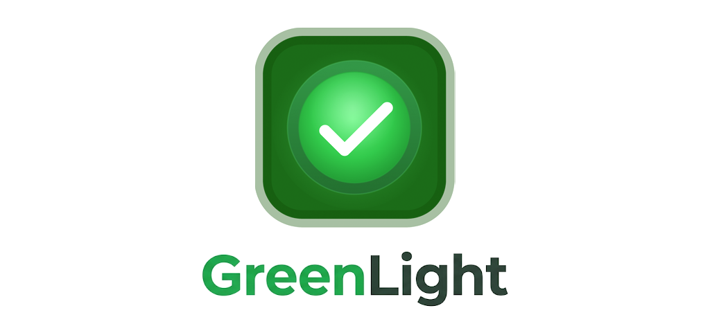
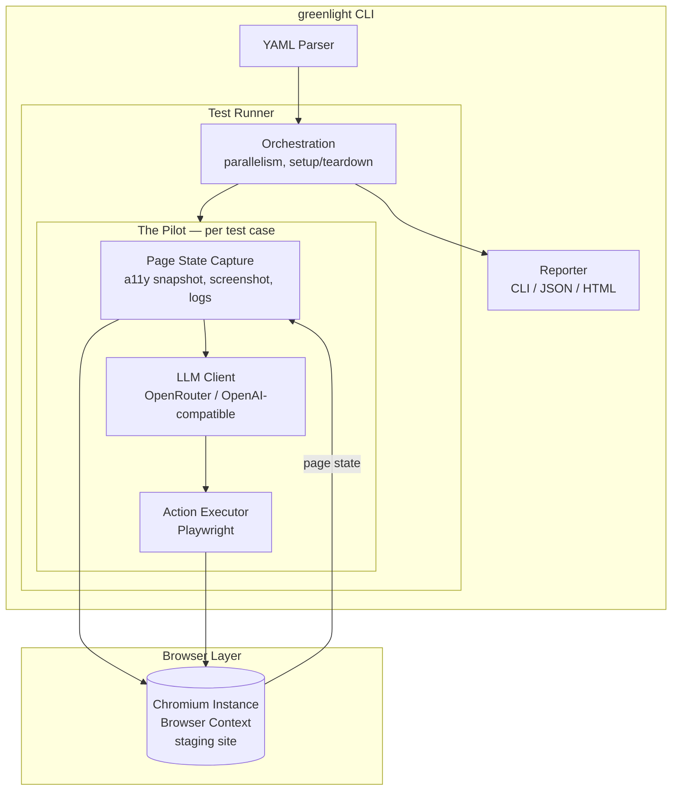

<p align="center">
  
</p>

# GreenLight

AI-driven end-to-end testing for web applications. Write tests as plain-English user stories, and an AI agent (the Pilot) executes them against your staging environment using a real browser.

No selectors. No XPaths. No test IDs. Just describe what a user would do.

## How it works

```yaml
suite: "Login Flow"
base_url: "https://staging.example.com"
variables:
  user_email: "jane@example.com"
  user_password: "{{env.TEST_PASSWORD}}"

tests:
  - name: "User can log in and see dashboard"
    steps:
      - enter "{{user_email}}" into "Email"
      - enter "{{user_password}}" into "Password"
      - click "Sign In"
      - check that page contains "Welcome back, Jane"
      - check that URL contains "/dashboard"
```

The Pilot reads each step, observes the page through accessibility tree snapshots (with screenshot fallback), determines the right browser action via an LLM, and executes it through Playwright.

## Quick start

```bash
npm install
npm run build
npx greenlight run tests/login.yaml
```

## CLI

```bash
greenlight run [suites...]            # run suite YAML files
greenlight run --test "Login"         # filter by test name
greenlight run --base-url <url>       # override base URL
greenlight run --headed               # visible browser
greenlight run --parallel 4           # concurrent test cases
greenlight run --reporter json        # json output (also: cli, html)
greenlight run --output results.json  # write to file
greenlight run --timeout 15000        # per-step timeout (ms)
greenlight run --model openai/gpt-4o  # override LLM model
greenlight run --llm-base-url <url>   # use a different OpenAI-compatible API
greenlight run --debug                # verbose output (a11y tree, screenshots, logs)
```

## Test syntax

Tests are plain English. The Pilot interprets intent, so phrasing is flexible. Common patterns:

| Action | Example |
|--------|---------|
| Navigate | `go to "/products"` |
| Click | `click "Add to Cart" next to "Widget Pro"` |
| Type | `enter "jane@example.com" into "Email"` |
| Select | `select "Canada" from "Country"` |
| Scroll | `scroll down until "Footer" is visible` |
| Wait | `wait up to 10 seconds until "Dashboard" is visible` |
| Assert | `check that page contains "Order Confirmed"` |
| Variable | `save text from "Confirmation Code" as "code"` |

Reusable steps can be defined at the suite level and invoked by name:

```yaml
reusable_steps:
  log in as admin:
    - enter "{{admin_email}}" into "Email"
    - enter "{{admin_password}}" into "Password"
    - click "Sign In"

tests:
  - name: "Admin can access settings"
    steps:
      - log in as admin
      - click "Settings"
      - check that page contains "Account Settings"
```

## Configuration

### API key

Set your API key via environment variable or a `.env` file in the project root:

```bash
OPENROUTER_API_KEY=sk-or-v1-...
```

`LLM_API_KEY` is also supported as a generic fallback for non-OpenRouter providers.

### Model selection

The LLM model is configurable at three levels (highest priority first):

| Level | How | Example |
|-------|-----|---------|
| CLI flag | `--model <id>` | `--model openai/gpt-4o` |
| Suite YAML | `model` field | `model: "anthropic/claude-sonnet-4"` |
| Default | — | `anthropic/claude-sonnet-4` via OpenRouter |

```yaml
suite: "Login Flow"
base_url: "https://staging.example.com"
model: "google/gemini-2.5-flash"  # optional per-suite override

tests:
  - name: "User can log in"
    steps:
      - click "Sign In"
```

### Custom LLM endpoint

GreenLight uses the OpenAI-compatible chat completions API. By default it points to OpenRouter, but you can use any compatible provider:

```bash
# Local Ollama
greenlight run tests/ --llm-base-url http://localhost:11434/v1 --model llama3

# Direct OpenAI
LLM_API_KEY=sk-... greenlight run tests/ --llm-base-url https://api.openai.com/v1 --model gpt-4o
```

## Tech stack

| Layer | Technology |
|-------|-----------|
| Browser automation | Playwright (Chromium) |
| Page representation | Accessibility tree (primary) + screenshots (fallback) |
| AI | OpenRouter (any OpenAI-compatible provider) |
| Test definitions | YAML |
| Language | TypeScript (Node.js, ESM) |

## Architecture



The Pilot loop per step: capture page state (a11y tree + optional screenshot) → send to the LLM with the plain-English step → receive a structured action (`{ action: "click", ref: "e42" }`) → execute via Playwright → capture result.

## Documentation

- [Specifications](docs/specifications.md) — full feature spec, technology decisions, MCP strategy
- [Implementation Plan](docs/implementation.md) — step-by-step build plan

## CI/CD

```yaml
- name: Run E2E tests
  run: greenlight run --reporter json --output results.json
  env:
    GREENLIGHT_BASE_URL: ${{ env.STAGING_URL }}
    OPENROUTER_API_KEY: ${{ secrets.OPENROUTER_API_KEY }}
```

Exit code 0 on all-pass, non-zero on any failure.
