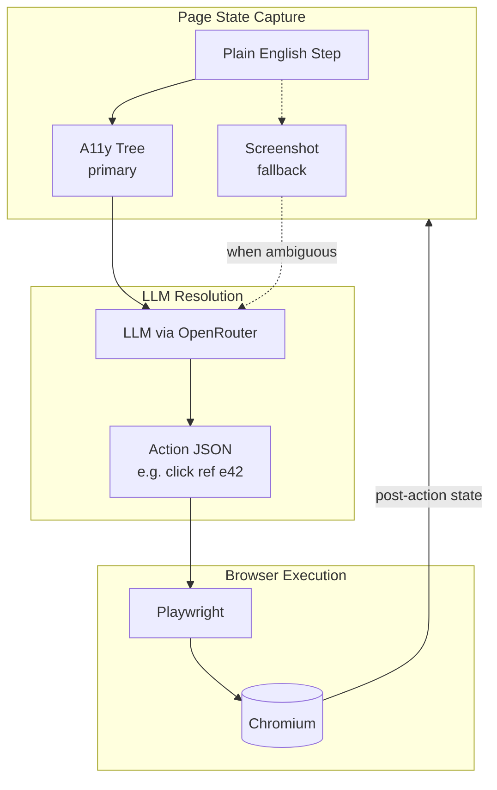
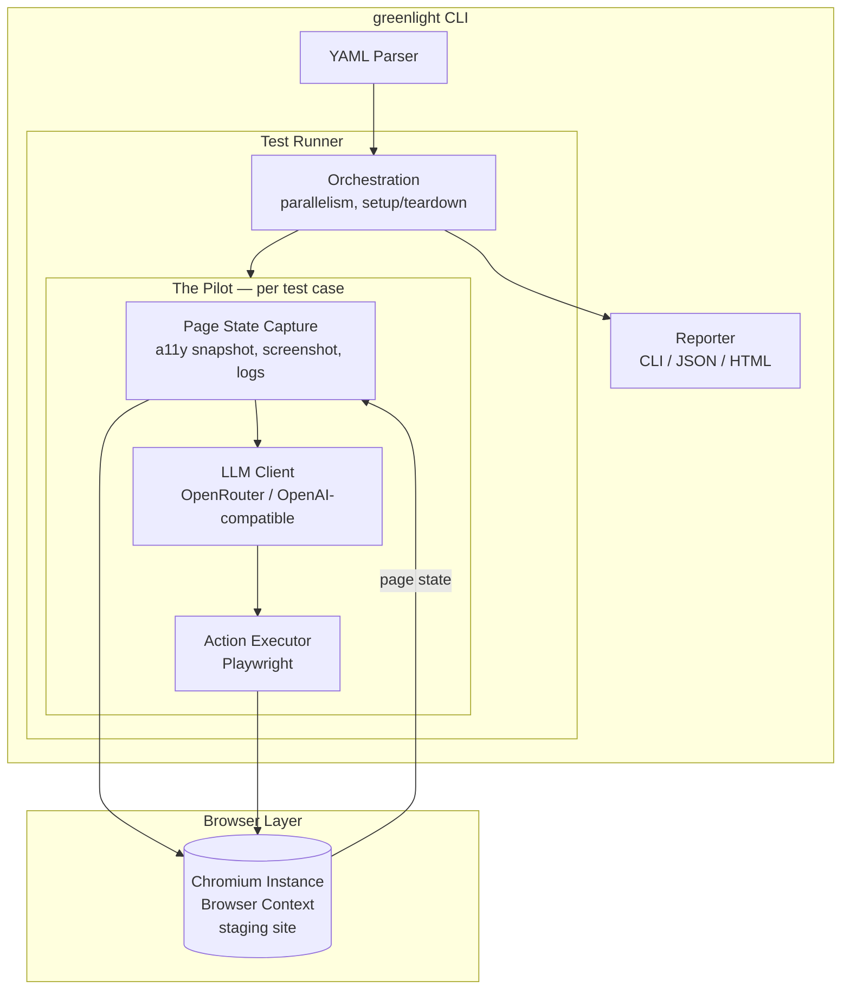

# GreenLight - E2E Testing Tool

## Overview

GreenLight is an in-house, AI-driven end-to-end testing tool that validates staging deployments of web applications by executing user stories through an AI-based client. Rather than requiring testers to write low-level selectors or automation scripts, tests are expressed as plain-English user stories that describe *what a real user would do*. An Pilot interprets and executes these stories against a live staging environment, interacting with the application the way a human would.

---

## Core Concepts

### Test Suite
A collection of test cases targeting a specific application or deployment. A suite is bound to a **base URL** (the staging environment) and contains shared configuration such as authentication credentials, viewport settings, and global variables.

### Test Case
A single user story expressed in plain English, composed of **steps**. Each test case has a name, an optional description, and a sequence of steps that the Pilot will execute and verify.

### Step
An individual instruction within a test case. Steps describe actions (click, type, navigate) or assertions (check that something is visible, verify text content). Steps are written in natural language and interpreted by the Pilot at runtime.

### The Pilot
The AI driven execution engine that reads a step, observes the current state of the page, determines the appropriate browser action, executes it, and reports the result. The Pilot uses vision (screenshots) and DOM analysis to understand the page and locate elements by their visible text, labels, or spatial relationships rather than CSS selectors or XPaths.

---

## MVP Feature Set

### 1. Test Authoring

#### 1.1 Plain-English Step Syntax
Tests are written as ordered lists of plain-English instructions. The Pilot interprets intent, so exact phrasing is flexible, but the following patterns should be reliably understood:

**Navigation**
```
go to "/products"
go to "https://staging.example.com/login"
open new tab
switch to tab 2
go back
reload the page
```

**Clicking**
```
click "Sign In"
click the "Add to Cart" button
click "Delete" next to "Expired Subscription"
double click "Cell A1"
```

**Typing & Input**
```
enter "jane@example.com" into "Email"
type "Hello world" into the "Message" field
clear "Search" and enter "new query"
press Enter
```

**Selection**
```
select "Canada" from "Country"
check the "I agree to the terms" checkbox
toggle "Enable notifications" off
```

**Scrolling**
```
scroll down
scroll down until "Footer" is visible
```

**Waiting**
```
wait until "Loading" disappears
wait up to 10 seconds until "Dashboard" is visible
```

#### 1.2 Assertions
Assertions verify that the application is in the expected state. A failing assertion fails the test case.

```
check that page contains "Welcome back, Jane"
check that "Email" has value "jane@example.com"
check that "Submit" button is disabled
check that page does not contain "Error"
check that page title is "Dashboard - MyApp"
check that URL contains "/dashboard"
check that element "Total" contains "$49.99"
```

#### 1.3 Variables & Test Data
Tests can use variables for dynamic data, parameterization, and passing values between steps.

```
store "testuser_{{timestamp}}" as "username"
enter stored value "username" into "Username"
save text from "Confirmation Code" as "code"
enter stored value "code" into "Verification"
```

**Global variables** can be defined at the suite level and referenced across test cases (e.g., shared credentials, environment-specific values).

#### 1.4 Reusable Steps (Subroutines)
Common sequences (e.g., login, add-to-cart) can be defined once and invoked by name:

```
# Definition (in suite-level reusable steps)
define "log in as admin":
    enter "admin@example.com" into "Email"
    enter "s3cret" into "Password"
    click "Sign In"
    check that page contains "Dashboard"

# Usage in a test case
log in as admin
go to "/settings"
```

### 2. Test Execution

#### 2.1 AI-Based Element Resolution
The Pilot locates elements using a **dual-representation strategy**: accessibility tree first, vision fallback.

**Primary: Accessibility Tree Snapshots**
After each action, Playwright captures the page's accessibility tree as a compact YAML structure (~2-5KB). Each interactive element receives a stable reference (e.g., `ref: e21`). The Pilot resolves step targets against this structured data:
- **Visible text and labels** - `click "Sign In"` matches against element accessible names and roles.
- **Spatial relationships** - `click "Edit" next to "Jane Doe"` uses the tree's hierarchy and ordering to resolve proximity.
- **Semantic understanding** - `enter "query" into the search field` matches against roles (`role: searchbox`) and ARIA labels even without an exact text match.

This approach is token-efficient (~200-400 tokens per snapshot vs ~3000-5000 for full DOM) and resilient to CSS/layout changes that don't affect semantic structure.

**Fallback: Screenshot Analysis (Vision)**
When the accessibility tree is insufficient (e.g., canvas-heavy UIs, custom-rendered components without ARIA markup, or ambiguous spatial layouts), the Pilot falls back to capturing a screenshot and using the LLM's vision capabilities to locate the target element by visual appearance and position.

No CSS selectors, XPaths, or test IDs are required. This makes tests resilient to UI refactors that don't change user-facing behavior.

#### 2.2 Browser Automation
The Pilot drives a real browser via **Playwright** (Node.js). Playwright is chosen for its auto-waiting (elements must be actionable before interaction, eliminating manual wait logic), lightweight Browser Contexts for parallel isolation, built-in accessibility tree snapshots, and a path to multi-browser support (Chromium, Firefox, WebKit) post-MVP.

MVP supports:
- **Chromium** (single browser engine)
- Desktop viewport (configurable width/height)
- Cookie/localStorage manipulation for setup purposes
- File download detection
- Basic file upload (providing a file path to a file input)

#### 2.3 Authentication Support
Since the tool targets staging environments, it must handle login flows:
- **Pre-test login steps** - defined as reusable steps and run before each test case.
- **Cookie injection** - optionally skip the login UI by injecting session cookies.
- **Stored credentials** - suite-level variables for usernames/passwords.

#### 2.4 Step Execution & Retry
Each step is executed with:
- A configurable **timeout** (default: 10 seconds) for the AI to locate elements and complete the action.
- Automatic **retry** on transient failures (e.g., element not yet visible due to animation).
- A **screenshot** captured after each step for debugging and reporting.

#### 2.5 Parallel Execution
Multiple test cases within a suite can run in parallel using **Playwright Browser Contexts** — isolated sessions sharing a single Chromium process. This is significantly more memory-efficient than spawning separate browser processes per test case and scales linearly to at least 8 concurrent contexts.

### 3. Reporting & Debugging

#### 3.1 Test Results
Each test run produces a report containing:
- **Pass/fail status** per test case and per step.
- **Duration** of each step and the total test case.
- **Screenshots** at each step (annotated with what the Pilot did, e.g., "clicked here" highlighted).
- **Error details** on failure: which step failed, what the Pilot saw, what it expected, and what went wrong.

#### 3.2 Output Formats
- **CLI output** - colored pass/fail summary with failure details, suitable for CI pipelines.
- **JSON report** - machine-readable results for integration with other systems.
- **HTML report** - human-readable report with embedded screenshots and step-by-step timeline.

#### 3.3 Logs
- Full Pilot reasoning log: for each step, what the Pilot observed, what action it chose, and why.
- Browser console log capture.
- Network request log (URLs and status codes, not full bodies).

### 4. Configuration & Integration

#### 4.1 Test Definition Format
Test suites are defined in YAML files checked into the repository:

```yaml
suite: "Checkout Flow"
base_url: "https://staging.example.com"
viewport:
  width: 1280
  height: 720
variables:
  admin_email: "admin@example.com"
  admin_password: "s3cret"

reusable_steps:
  log in as admin:
    - enter "{{admin_email}}" into "Email"
    - enter "{{admin_password}}" into "Password"
    - click "Sign In"
    - check that page contains "Dashboard"

tests:
  - name: "User can complete checkout"
    steps:
      - log in as admin
      - click "Products"
      - click "Add to Cart" next to "Widget Pro"
      - click "Cart"
      - check that page contains "Widget Pro"
      - check that element "Total" contains "$29.99"
      - click "Checkout"
      - enter "4242 4242 4242 4242" into "Card Number"
      - enter "12/27" into "Expiry"
      - enter "123" into "CVC"
      - click "Pay Now"
      - check that page contains "Order Confirmed"

  - name: "User sees error on invalid card"
    steps:
      - log in as admin
      - click "Products"
      - click "Add to Cart" next to "Widget Pro"
      - click "Cart"
      - click "Checkout"
      - enter "0000 0000 0000 0000" into "Card Number"
      - enter "12/27" into "Expiry"
      - enter "000" into "CVC"
      - click "Pay Now"
      - check that page contains "Your card was declined"
```

#### 4.2 CLI Interface
```bash
# Run all suites
greenlight run

# Run a specific suite file
greenlight run tests/checkout.yaml

# Run a specific test case by name
greenlight run tests/checkout.yaml --test "User can complete checkout"

# Override base URL (e.g., for a PR preview deployment)
greenlight run --base-url https://pr-123.staging.example.com

# Output options
greenlight run --reporter json --output results.json
greenlight run --reporter html --output report.html

# Run headed (visible browser) for debugging
greenlight run --headed

# Set parallelism
greenlight run --parallel 4
```

#### 4.3 CI/CD Integration
The CLI exits with code 0 on all-pass, non-zero on any failure, making it suitable for CI gates. The JSON reporter enables integration with dashboards and notification systems.

Minimal CI example (GitHub Actions):
```yaml
- name: Run E2E tests
  run: greenlight run --reporter json --output results.json
  env:
    GREENLIGHT_BASE_URL: ${{ env.STAGING_URL }}
```

#### 4.4 Environment Variables & Secrets
- Suite variables can reference environment variables: `{{env.ADMIN_PASSWORD}}`.
- Sensitive values are never logged or included in reports.

---

## Out of Scope for MVP

The following are explicitly **not** part of the initial release. They are noted here as potential future enhancements:

- **Mobile / responsive testing** - only desktop viewport in MVP.
- **Multi-browser support** - Chromium only; Firefox/Safari later.
- **Visual regression testing** - screenshot comparison / pixel diffing.
- **API-level testing** - direct HTTP request assertions (outside browser context).
- **Database assertions** - querying a DB to verify side effects.
- **Email/SMS verification** - testing 2FA flows or transactional emails.
- **Test recording** - browser extension to record actions and generate test files.
- **AI-generated tests** - auto-generating test cases from application analysis.
- **Scheduling & monitoring** - running tests on a cron and alerting on failure.
- **Multi-tab / multi-window workflows** beyond basic tab switching.
- **File upload testing** beyond simple file input fields.
- **iframe / shadow DOM** support.

---

## Non-Functional Requirements

### Performance
- A single test step should resolve and execute within 15 seconds under normal conditions.
- The full Pilot loop (screenshot, analyze, act, verify) should target < 5 seconds per step for simple actions.
- Suite-level parallelism must scale linearly up to at least 8 concurrent browser instances.

### Reliability
- The Pilot must achieve > 95% first-attempt accuracy on element resolution for well-labeled UIs.
- Flaky test rate should be < 5% for deterministic test cases (same app state = same result).
- Automatic retry of transient failures (network blips, slow renders) before marking a step as failed.

### Security
- Credentials and secrets are never written to reports, logs, or screenshots.
- The tool runs in the user's own environment — no data leaves the network beyond LLM API calls.
- The LLM API receives accessibility tree snapshots and screenshots only; it does not receive raw application data, database contents, or full DOM/HTML.

### Usability
- A new user should be able to write and run their first test within 15 minutes.
- Error messages must clearly explain what failed and suggest how to fix the test.
- No knowledge of HTML, CSS, JavaScript, or browser internals should be required to author tests.

---

## Technology Decisions

### Browser Automation: Playwright (Node.js)

**Chosen over** Puppeteer, raw CDP, and Selenium.

| Criteria | Playwright | Puppeteer | Raw CDP | Selenium |
|----------|-----------|-----------|---------|----------|
| Auto-waiting | Built-in | Manual | Manual | Manual |
| A11y tree snapshots | Native API | N/A | Manual | N/A |
| Parallel isolation | Browser Contexts (lightweight) | Separate processes (heavy) | Manual | Separate drivers |
| Multi-browser | Chromium, Firefox, WebKit | Chromium only | Chromium only | All browsers |
| AI ecosystem | Playwright MCP, @playwright/cli | Limited | browser-use | N/A |

**Rationale:**
- **Auto-waiting** eliminates flakiness from timing issues — Playwright waits for elements to be actionable before interacting, which is critical when the Pilot drives a real staging environment with unpredictable load times.
- **Accessibility tree snapshots** are the most token-efficient way to represent page state to the LLM (~2-5KB vs ~100KB+ for screenshots). Playwright exposes this natively.
- **Browser Contexts** provide lightweight parallel isolation. Running 8 test cases concurrently uses one Chromium process instead of eight.
- **Multi-browser path** — MVP is Chromium-only, but adding Firefox/WebKit requires zero code changes to the automation layer.

**Why not raw CDP?** Projects like browser-use have moved to raw CDP for ~5x faster element extraction. However, this requires rebuilding crash handling, dialog management, iframe support, and file operations from scratch — too much infrastructure burden for an MVP. If Playwright becomes a bottleneck on specific hot paths, we can drop to CDP selectively via Playwright's `CDPSession` API without a full rewrite.

### Page Representation: Accessibility Tree + Vision Fallback



**Strategy:** The accessibility tree is the *primary* representation for every step. The LLM receives it as structured text and resolves element references against it. Screenshots are captured after every step for reports, but only sent to the LLM when:
1. The a11y tree yields no confident match for the step target.
2. The step explicitly references visual properties (e.g., "click the red button").
3. An assertion references visual state not captured in the a11y tree.

This keeps token costs low (benchmarks show ~4x fewer tokens vs screenshot-only approaches) while retaining full visual understanding as a fallback.

### MCP Strategy

GreenLight's architecture is informed by Microsoft's Playwright MCP server pattern but does **not** use MCP as a runtime protocol. Instead, we adopt the key architectural insight from Playwright MCP — structured accessibility snapshots with stable element references — as an internal design pattern.

**What we take from Playwright MCP:**
- **Snapshot-based page representation** — after each browser action, capture the accessibility tree as a compact structured snapshot. Each element gets a stable reference ID (e.g., `e21`) that can be used in subsequent actions.
- **Element refs as the action interface** — the LLM reasons about accessible names, roles, and states, then returns an element ref. The browser layer resolves that ref to a concrete locator. This decouples the LLM's understanding from implementation details.
- **Progressive disclosure** — the Pilot does not dump the full page state into every prompt. It provides the a11y snapshot for resolution, and only loads additional context (screenshots, DOM subtrees) when the snapshot is insufficient.

**What we do NOT adopt:**
- **MCP as a transport protocol** — MCP adds a client/server protocol layer designed for interoperability between different AI tools and hosts. GreenLight is a self-contained tool where the Pilot, browser driver, and LLM client are tightly integrated. The indirection of MCP would add latency and complexity without benefit.
- **Generic tool discovery** — MCP servers expose tools dynamically for arbitrary AI clients. The Pilot has a fixed, known set of browser actions (click, type, navigate, assert, etc.). Static binding is simpler and faster.

**Future MCP consideration:** If GreenLight eventually exposes its browser automation capabilities to external AI agents or IDE integrations (e.g., a GreenLight MCP server that lets Claude Code run tests), MCP becomes the right protocol for that integration surface. This is out of scope for MVP.

### LLM: Provider-Agnostic via OpenRouter

The Pilot communicates with the LLM through the **OpenAI-compatible chat completions API**, using **OpenRouter** as the default gateway. This allows any model to be used without code changes.

- **Text input** — the plain-English step + accessibility tree snapshot.
- **Vision input** — screenshots when the a11y tree fallback is triggered (as base64 image content blocks).
- **Structured output** — the LLM returns JSON actions (`{ action, ref, params }`) parsed by the Pilot.

**Configuration:**
- `model` — configurable per suite in YAML or via `--model` CLI flag. Default: `anthropic/claude-sonnet-4` via OpenRouter.
- `OPENROUTER_API_KEY` / `LLM_API_KEY` — API key from environment variable.
- `--llm-base-url` — override the API endpoint to use any OpenAI-compatible provider (direct OpenAI, Azure, local Ollama, etc.).

**Why OpenRouter?** Single API key for access to Claude, GPT-4o, Gemini, Llama, and others. Teams can experiment with different models per suite without managing multiple provider credentials. For production, the base URL can be pointed directly at any provider's API.

---

## Architecture (High Level)

<!-- NOTE: Keep this Mermaid diagram in sync as the spec evolves.
     When adding/removing components, update both the diagram and the
     Component Responsibilities list below it. -->



### Component Responsibilities

1. **CLI** — Entry point. Parses arguments, loads suite config, invokes the runner, outputs results.
2. **YAML Parser** — Reads and validates suite definitions. Resolves variables, environment references, and reusable step expansions.
3. **Test Runner** — Orchestrates execution. Creates Playwright Browser Contexts for parallelism, assigns one Pilot instance per test case, collects results, handles setup/teardown.
4. **The Pilot** — The core loop per test case:
   - Receives the next step (plain English).
   - Calls **Page State Capture** to get the current a11y snapshot (and optionally a screenshot).
   - Sends the step + page state to the **LLM Client**.
   - Receives a structured action (`{ action: "click", ref: "e42" }`).
   - Calls the **Action Executor** to perform the action via Playwright.
   - Captures the post-action state for reporting.
   - Evaluates pass/fail for assertion steps.
5. **Page State Capture** — Playwright wrapper that produces:
   - Accessibility tree snapshot (YAML with element refs).
   - Viewport screenshot (PNG).
   - Browser console logs and network events.
6. **LLM Client** — Sends prompts to an OpenAI-compatible chat completions endpoint (OpenRouter by default). Manages the system prompt (Pilot persona, available actions), handles structured output parsing, and logs reasoning traces. Provider and model are configurable per suite.
7. **Action Executor** — Translates structured actions into Playwright calls. Resolves element refs from the a11y snapshot to Playwright locators. Handles auto-waiting, retries, and timeout enforcement.
8. **Reporter** — Collects step results, screenshots, reasoning traces, and timing data. Generates output in CLI, JSON, or HTML format.

---

## Glossary

| Term | Definition |
|------|-----------|
| **Suite** | A YAML file defining a set of test cases, shared config, and reusable steps for one application or feature area. |
| **Test Case** | A named sequence of steps representing a user story to verify. |
| **Step** | A single plain-English instruction: an action or an assertion. |
| **The Pilot** | The AI-driven component that interprets steps, observes the page via accessibility tree snapshots and screenshots, and drives the browser through Playwright. |
| **Reusable Step** | A named sequence of steps that can be invoked by name from any test case in the suite. |
| **Base URL** | The root URL of the staging environment under test. |
| **Variable** | A named value that can be set at suite level, generated during execution, or sourced from environment variables. |
| **Accessibility Tree (a11y tree)** | A compact, structured representation of a page's interactive elements (roles, names, states) captured by Playwright. Used as the primary page representation for the Pilot, far more token-efficient than screenshots or full DOM. |
| **Element Ref** | A stable identifier (e.g., `e21`) assigned to each element in an accessibility tree snapshot. The Pilot returns element refs in its actions; the Action Executor resolves them to Playwright locators. |
| **Browser Context** | A Playwright isolation primitive — an independent browser session (cookies, storage, cache) within a single Chromium process. Used for lightweight parallel test execution. |
| **MCP (Model Context Protocol)** | A protocol for AI tool interoperability. GreenLight adopts MCP's architectural patterns (structured snapshots, element refs) internally but does not use MCP as a runtime transport. |
