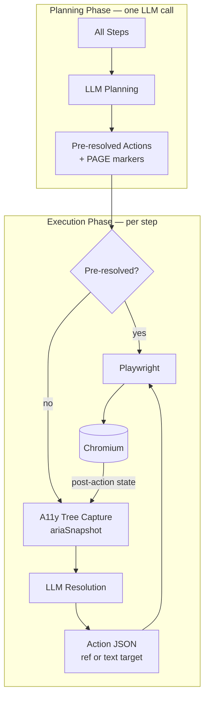
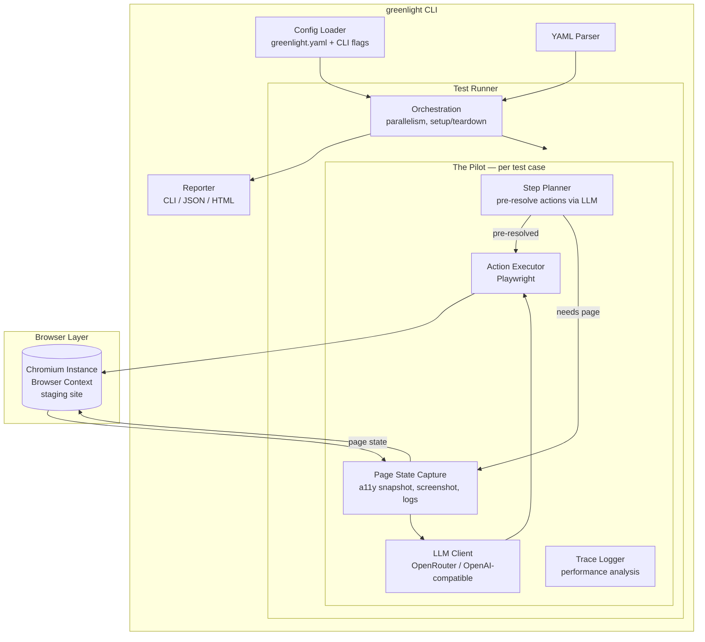

# GreenLight - E2E Testing Tool

## Overview

GreenLight is an in-house, AI-driven end-to-end testing tool that validates staging deployments of web applications by executing user stories through an AI-based client. Rather than requiring testers to write low-level selectors or automation scripts, tests are expressed as plain-English user stories that describe *what a real user would do*. An Pilot interprets and executes these stories against a live staging environment, interacting with the application the way a human would.

---

## Core Concepts

### Test Suite
A collection of test cases targeting a specific application or deployment. A suite is bound to a **base URL** (the staging environment) and contains shared configuration such as authentication credentials, viewport settings, and global variables.

### Test Case
A single user story expressed in plain English, composed of **steps**. Each test case has a name, an optional description, and a sequence of steps that the Pilot will execute and verify.

### Step
An individual instruction within a test case. Steps describe actions (click, type, navigate) or assertions (check that something is visible, verify text content). Steps are written in natural language and interpreted by the Pilot at runtime.

### The Pilot
The AI driven execution engine that reads a step, observes the current state of the page, determines the appropriate browser action, executes it, and reports the result. The Pilot uses vision (screenshots) and DOM analysis to understand the page and locate elements by their visible text, labels, or spatial relationships rather than CSS selectors or XPaths.

---

## MVP Feature Set

### 1. Test Authoring

#### 1.1 Plain-English Step Syntax
Tests are written as ordered lists of plain-English instructions. The Pilot interprets intent, so exact phrasing is flexible, but the following patterns should be reliably understood:

**Navigation**
```
go to "/products"
go to "https://staging.example.com/login"
open new tab
switch to tab 2
go back
reload the page
```

**Clicking**
```
click "Sign In"
click the "Add to Cart" button
click "Delete" next to "Expired Subscription"
double click "Cell A1"
```

**Typing & Input**
```
enter "jane@example.com" into "Email"
type "Hello world" into the "Message" field
clear "Search" and enter "new query"
press Enter
```

**Selection**
```
select "Canada" from "Country"
check the "I agree to the terms" checkbox
toggle "Enable notifications" off
```

**Scrolling**
```
scroll down
scroll down until "Footer" is visible
```

**Waiting**
```
wait until "Loading" disappears
wait up to 10 seconds until "Dashboard" is visible
```

#### 1.2 Assertions
Assertions verify that the application is in the expected state. A failing assertion fails the test case.

```
check that page contains "Welcome back, Jane"
check that "Email" has value "jane@example.com"
check that "Submit" button is disabled
check that page does not contain "Error"
check that page title is "Dashboard - MyApp"
check that URL contains "/dashboard"
check that element "Total" contains "$49.99"
```

#### 1.3 Variables & Test Data
Tests can use variables for dynamic data, parameterization, and passing values between steps.

```
store "testuser_{{timestamp}}" as "username"
enter stored value "username" into "Username"
save text from "Confirmation Code" as "code"
enter stored value "code" into "Verification"
```

**Global variables** can be defined at the suite level and referenced across test cases (e.g., shared credentials, environment-specific values).

#### 1.4 Reusable Steps (Subroutines)
Common sequences (e.g., login, add-to-cart) can be defined once and invoked by name:

```
# Definition (in suite-level reusable steps)
define "log in as admin":
    enter "admin@example.com" into "Email"
    enter "s3cret" into "Password"
    click "Sign In"
    check that page contains "Dashboard"

# Usage in a test case
log in as admin
go to "/settings"
```

### 2. Test Execution

#### 2.1 AI-Based Element Resolution
The Pilot locates elements using a **dual-representation strategy**: accessibility tree first, visible text fallback.

**Primary: Accessibility Tree Snapshots**
After each action, Playwright captures the page's accessibility tree via `page.locator("body").ariaSnapshot()` as a compact YAML-like structure. During parsing, each interactive element receives a stable reference ID (e.g., `e21`). The Pilot resolves step targets against this structured data:
- **Visible text and labels** - `click "Sign In"` matches against element accessible names and roles.
- **Spatial relationships** - `click "Edit" next to "Jane Doe"` uses the tree's hierarchy and ordering to resolve proximity.
- **Semantic understanding** - `enter "query" into the search field` matches against roles (`role: searchbox`) and ARIA labels even without an exact text match.

This approach is token-efficient and resilient to CSS/layout changes that don't affect semantic structure.

**Element Resolution Strategy**
When the Pilot returns an element ref, the Action Executor resolves it to a Playwright locator using a multi-strategy approach (tried in order):
1. **Chained hierarchy** — walk the a11y tree path from ancestor to target, chaining `getByRole` calls through named ancestors for disambiguation.
2. **Direct role + exact name** — `page.getByRole(role, { name, exact: true })`.
3. **Label** — `page.getByLabel(name, { exact: true })` for form inputs.
4. **Placeholder** — `page.getByPlaceholder(name, { exact: true })` for text inputs.
5. **Direct role + loose name** — `page.getByRole(role, { name })` without exact matching.

**Fallback: Visible Text Matching**
When the target element is not in the accessibility tree (e.g., page markup lacks proper ARIA roles), the LLM returns a `text` field instead of a `ref`. The executor falls back to locating the element by its visible text content using `getByRole("link"/"button")` and `getByText` with both exact and loose matching.

No CSS selectors, XPaths, or test IDs are required. This makes tests resilient to UI refactors that don't change user-facing behavior.

#### 2.2 Browser Automation
The Pilot drives a real browser via **Playwright** (Node.js). Playwright is chosen for its auto-waiting (elements must be actionable before interaction, eliminating manual wait logic), lightweight Browser Contexts for parallel isolation, built-in accessibility tree snapshots, and a path to multi-browser support (Chromium, Firefox, WebKit) post-MVP.

MVP supports:
- **Chromium** (single browser engine)
- Desktop viewport (configurable width/height)
- Cookie/localStorage manipulation for setup purposes
- File download detection
- Basic file upload (providing a file path to a file input)

#### 2.3 Authentication Support
Since the tool targets staging environments, it must handle login flows:
- **Pre-test login steps** - defined as reusable steps and run before each test case.
- **Cookie injection** - optionally skip the login UI by injecting session cookies.
- **Stored credentials** - suite-level variables for usernames/passwords.

#### 2.4 Two-Phase Execution: Plan Then Resolve
The Pilot uses a two-phase approach for each test case:

1. **Planning phase** — Before any browser interaction, the full list of natural-language steps is sent to the LLM in a single request. The LLM interprets each step and returns a flat list of atomic actions. Steps that can be resolved without page state (assertions with literal text, navigation, key presses) are pre-resolved into concrete actions. Steps that require seeing the page (clicks, typing into specific fields) are marked as needing runtime resolution.
2. **Execution phase** — The Pilot iterates through the planned steps. Pre-resolved actions execute directly without an LLM call. Page-dependent steps go through the full capture → LLM → execute cycle.

This approach reduces LLM calls significantly — often by 50% or more — since assertions, navigation, and key presses are resolved in the single planning call.

If planning fails (e.g., LLM error), the Pilot falls back to runtime resolution for all steps.

#### 2.5 Step Execution & Retry
Each step is executed with:
- A configurable **timeout** (default: 30 seconds) for the AI to locate elements and complete the action.
- Automatic **retry** on transient failures (e.g., element not yet visible due to animation) — planned for a future step.
- A **screenshot** captured after each successful step for debugging and reporting.
- **Navigation handling** — actions that trigger page navigation are detected via `framenavigated` events, and the executor waits for `domcontentloaded` before proceeding.

#### 2.6 Parallel Execution
Multiple test cases within a suite can run in parallel using **Playwright Browser Contexts** — isolated sessions sharing a single Chromium process. This is significantly more memory-efficient than spawning separate browser processes per test case and scales linearly to at least 8 concurrent contexts.

### 3. Cached Heuristic Test Plans

#### 3.1 Overview

Running every test step through the full LLM loop (natural language → accessibility tree → LLM reasoning → action) is accurate but slow and expensive. To enable fast, repeatable test runs without LLM calls, GreenLight implements a two-phase execution model:

1. **Discovery run (full LLM)** — The Pilot executes the test as normal, using the LLM to interpret each natural-language step. During this run, it records a **heuristic test plan**: a concrete, element-level plan that replaces natural-language descriptions with detected page elements and deterministic actions.
2. **Fast run (cached plan)** — On subsequent runs, if the original test definition has not changed, GreenLight replays the cached heuristic plan directly against the browser using Playwright — no LLM calls required.

This provides the best of both worlds: AI-powered test authoring with deterministic, fast execution.

#### 3.2 Discovery Run and Plan Generation

During a discovery run, the Pilot processes each natural-language step through the normal LLM loop. For each step, it records:

- The **original natural-language step** text.
- The **resolved action** returned by the LLM (e.g., `{ action: "click", ref: "e42" }`).
- The **concrete element selector** used by Playwright to execute the action (role, name, and any additional attributes needed to locate the element deterministically).
- For assertion steps: the **concrete assertion** (e.g., `{ type: "text_contains", selector: { role: "heading", name: "Dashboard" }, expected: "Welcome back" }`).
- A **post-step page state fingerprint** (URL, page title, key visible elements) to detect when the cached plan has drifted from the actual application state.

The result is a **heuristic test plan** — a sequence of concrete, element-bound actions that can be replayed without LLM involvement.

#### 3.3 Plan Storage

Cached plans are stored in a `.greenlight/` directory at the project root:

```
.greenlight/
├── plans/
│   ├── checkout-flow/                    # One directory per suite (slugified suite name)
│   │   ├── user-can-complete-checkout.json   # One file per test case
│   │   └── user-sees-error-on-invalid-card.json
│   └── search-flow/
│       └── user-can-search-products.json
└── hashes.json                           # Hash index for change detection
```

Each plan file contains:
- The **heuristic steps**: concrete actions with element selectors and expected outcomes.
- The **source hash**: a SHA-256 hash of the original natural-language test definition (suite variables, reusable step expansions, and all step text that contributed to this test case).
- **Metadata**: model used, timestamp of generation, GreenLight version.

The `hashes.json` file maps each test case (by suite + test name) to its source hash for fast change detection without reading every plan file.

#### 3.4 Change Detection

Before executing a test case, GreenLight computes the SHA-256 hash of the test case's **effective definition** — the fully resolved step list after variable interpolation and reusable step expansion. This hash is compared against the stored hash in `.greenlight/hashes.json`:

- **Hash matches** → use the cached heuristic plan (fast run).
- **Hash does not match** → discard the cached plan, run a full discovery run, and store the new heuristic plan.
- **No cached plan exists** → run a full discovery run.

Changes that trigger re-generation:
- Any modification to a test case's step text.
- Changes to suite-level variables referenced by the test case.
- Changes to reusable step definitions used by the test case.
- Adding or removing steps.

Changes that do **not** trigger re-generation:
- Modifications to other test cases in the same suite.
- Changes to reporter configuration, parallelism settings, or other runtime options.
- Changes to `base_url` (the cached plan uses relative selectors, not absolute URLs).

#### 3.5 Fast Run Execution

When a cached heuristic plan is available and valid, the fast run:

1. Reads the plan file for the test case.
2. For each heuristic step, executes the concrete Playwright action directly (no LLM call).
3. After each step, validates the **post-step fingerprint** against expectations. If the page state has drifted significantly (e.g., expected element not found, unexpected URL), the step is marked as a **plan drift failure**.
4. On plan drift failure: the fast run stops, logs a warning that the cached plan is stale, and optionally falls back to a full discovery run (controlled by `--on-drift` flag: `fail` | `rerun`, default: `fail`).

Assertions in the heuristic plan are evaluated directly against the page state using Playwright queries — no LLM interpretation needed.

#### 3.6 CLI Flags

```bash
# Force a full discovery run (ignore cached plans)
greenlight run --discover

# Use cached plans where available (default behavior)
greenlight run

# Control behavior on plan drift
greenlight run --on-drift rerun    # Re-run with LLM on drift (default: fail)

# Show plan status without running
greenlight run --plan-status
# → checkout-flow/user-can-complete-checkout: cached (hash: abc123, generated: 2025-01-15)
# → checkout-flow/user-sees-error: stale (definition changed)
# → search-flow/user-can-search: no cached plan
```

#### 3.7 The `.greenlight` Directory

The `.greenlight/` directory should be added to `.gitignore` by default — cached plans are environment-specific (element selectors may differ between staging deployments). However, teams may choose to commit them if their staging environment is stable, trading portability for faster CI runs.

### 4. Reporting & Debugging

#### 4.1 Test Results
Each test run produces a report containing:
- **Pass/fail status** per test case and per step.
- **Duration** of each step and the total test case.
- **Screenshots** at each step (annotated with what the Pilot did, e.g., "clicked here" highlighted).
- **Error details** on failure: which step failed, what the Pilot saw, what it expected, and what went wrong.

#### 4.2 Output Formats
- **CLI output** - colored pass/fail summary with failure details, suitable for CI pipelines.
- **JSON report** - machine-readable results for integration with other systems.
- **HTML report** - human-readable report with embedded screenshots and step-by-step timeline.

#### 4.3 Logs
- Full Pilot reasoning log: for each step, what the Pilot observed, what action it chose, and why.
- Browser console log capture.
- Network request log (URLs and status codes, not full bodies).

### 5. Configuration & Integration

#### 5.1 Test Definition Format
Test suites are defined in YAML files checked into the repository:

```yaml
suite: "Checkout Flow"
base_url: "https://staging.example.com"   # optional if set in greenlight.yaml or --base-url
model: "anthropic/claude-sonnet-4"        # optional, overridable per suite
viewport:
  width: 1280
  height: 720
variables:
  admin_email: "admin@example.com"
  admin_password: "s3cret"

reusable_steps:
  log in as admin:
    - enter "{{admin_email}}" into "Email"
    - enter "{{admin_password}}" into "Password"
    - click "Sign In"
    - check that page contains "Dashboard"

tests:
  - name: "User can complete checkout"
    steps:
      - log in as admin
      - click "Products"
      - click "Add to Cart" next to "Widget Pro"
      - click "Cart"
      - check that page contains "Widget Pro"
      - check that element "Total" contains "$29.99"
      - click "Checkout"
      - enter "4242 4242 4242 4242" into "Card Number"
      - enter "12/27" into "Expiry"
      - enter "123" into "CVC"
      - click "Pay Now"
      - check that page contains "Order Confirmed"

  - name: "User sees error on invalid card"
    steps:
      - log in as admin
      - click "Products"
      - click "Add to Cart" next to "Widget Pro"
      - click "Cart"
      - click "Checkout"
      - enter "0000 0000 0000 0000" into "Card Number"
      - enter "12/27" into "Expiry"
      - enter "000" into "CVC"
      - click "Pay Now"
      - check that page contains "Your card was declined"
```

#### 5.2 Project Configuration (`greenlight.yaml`)

An optional `greenlight.yaml` file in the project root provides shared configuration for all suites. It supports multiple named **deployments** (e.g., staging, preview) that override base configuration:

```yaml
suites:
  - "tests/**/*.yaml"

base_url: "https://staging.example.com"
model: "anthropic/claude-sonnet-4"
timeout: 30000
headed: false
parallel: 1
reporter: cli
viewport:
  width: 1280
  height: 720

deployments:
  preview:
    base_url: "https://preview.example.com"
  production:
    base_url: "https://app.example.com"
    headed: true

default_deployment: preview
```

**Resolution order** (highest priority first): CLI flags → selected deployment → top-level greenlight.yaml → suite YAML → built-in defaults.

The `suites` field is required and specifies glob patterns or paths to suite YAML files. When suite files are passed as CLI arguments, they override this field.

#### 5.3 CLI Interface
```bash
# Run all suites (from greenlight.yaml)
greenlight run

# Run a specific suite file
greenlight run tests/checkout.yaml

# Run a specific test case by name
greenlight run tests/checkout.yaml --test "User can complete checkout"

# Override base URL (e.g., for a PR preview deployment)
greenlight run --base-url https://pr-123.staging.example.com

# Select a named deployment from greenlight.yaml
greenlight run --deployment preview

# Output options
greenlight run --reporter json --output results.json
greenlight run --reporter html --output report.html

# Run headed (visible browser) for debugging
greenlight run --headed

# Set parallelism
greenlight run --parallel 4

# Debug and trace modes
greenlight run --debug          # verbose output: a11y trees, actions, plan details
greenlight run --trace          # timestamped browser events for performance analysis
```

#### 5.4 CI/CD Integration
The CLI exits with code 0 on all-pass, non-zero on any failure, making it suitable for CI gates. The JSON reporter enables integration with dashboards and notification systems.

Minimal CI example (GitHub Actions):
```yaml
- name: Run E2E tests
  run: greenlight run --reporter json --output results.json
  env:
    GREENLIGHT_BASE_URL: ${{ env.STAGING_URL }}
```

#### 5.5 Environment Variables & Secrets
- Environment variables are loaded from `.env` files via `dotenv` at startup.
- Suite variables can reference environment variables: `{{env.ADMIN_PASSWORD}}`.
- Sensitive values are never logged or included in reports.

---

## Out of Scope for MVP

The following are explicitly **not** part of the initial release. They are noted here as potential future enhancements:

- **Mobile / responsive testing** - only desktop viewport in MVP.
- **Multi-browser support** - Chromium only; Firefox/Safari later.
- **Visual regression testing** - screenshot comparison / pixel diffing.
- **API-level testing** - direct HTTP request assertions (outside browser context).
- **Database assertions** - querying a DB to verify side effects.
- **Email/SMS verification** - testing 2FA flows or transactional emails.
- **Test recording** - browser extension to record actions and generate test files.
- **AI-generated tests** - auto-generating test cases from application analysis.
- **Scheduling & monitoring** - running tests on a cron and alerting on failure.
- **Multi-tab / multi-window workflows** beyond basic tab switching.
- **File upload testing** beyond simple file input fields.
- **iframe / shadow DOM** support.

---

## Non-Functional Requirements

### Performance
- A single test step should resolve and execute within the configurable timeout (default: 30 seconds) under normal conditions.
- Pre-resolved steps (from the planning phase) execute without LLM calls and should complete in < 2 seconds.
- Page-dependent steps going through the full capture → LLM → execute cycle should target < 5 seconds for simple actions.
- Suite-level parallelism must scale linearly up to at least 8 concurrent browser instances.
- Fast runs using cached heuristic plans should execute each step in < 1 second (no LLM latency), achieving at least 5x speedup over discovery runs.

### Reliability
- The Pilot must achieve > 95% first-attempt accuracy on element resolution for well-labeled UIs.
- Flaky test rate should be < 5% for deterministic test cases (same app state = same result).
- Automatic retry of transient failures (network blips, slow renders) before marking a step as failed.

### Security
- Credentials and secrets are never written to reports, logs, or screenshots.
- The tool runs in the user's own environment — no data leaves the network beyond LLM API calls.
- The LLM API receives accessibility tree snapshots and screenshots only; it does not receive raw application data, database contents, or full DOM/HTML.

### Usability
- A new user should be able to write and run their first test within 15 minutes.
- Error messages must clearly explain what failed and suggest how to fix the test.
- No knowledge of HTML, CSS, JavaScript, or browser internals should be required to author tests.

---

## Technology Decisions

### Browser Automation: Playwright (Node.js)

**Chosen over** Puppeteer, raw CDP, and Selenium.

| Criteria | Playwright | Puppeteer | Raw CDP | Selenium |
|----------|-----------|-----------|---------|----------|
| Auto-waiting | Built-in | Manual | Manual | Manual |
| A11y tree snapshots | Native API | N/A | Manual | N/A |
| Parallel isolation | Browser Contexts (lightweight) | Separate processes (heavy) | Manual | Separate drivers |
| Multi-browser | Chromium, Firefox, WebKit | Chromium only | Chromium only | All browsers |
| AI ecosystem | Playwright MCP, @playwright/cli | Limited | browser-use | N/A |

**Rationale:**
- **Auto-waiting** eliminates flakiness from timing issues — Playwright waits for elements to be actionable before interacting, which is critical when the Pilot drives a real staging environment with unpredictable load times.
- **Accessibility tree snapshots** are the most token-efficient way to represent page state to the LLM (~2-5KB vs ~100KB+ for screenshots). Playwright exposes this natively.
- **Browser Contexts** provide lightweight parallel isolation. Running 8 test cases concurrently uses one Chromium process instead of eight.
- **Multi-browser path** — MVP is Chromium-only, but adding Firefox/WebKit requires zero code changes to the automation layer.

**Why not raw CDP?** Projects like browser-use have moved to raw CDP for ~5x faster element extraction. However, this requires rebuilding crash handling, dialog management, iframe support, and file operations from scratch — too much infrastructure burden for an MVP. If Playwright becomes a bottleneck on specific hot paths, we can drop to CDP selectively via Playwright's `CDPSession` API without a full rewrite.

### Page Representation: Accessibility Tree + Text Fallback



**Strategy:** The accessibility tree (captured via `page.locator("body").ariaSnapshot()`) is the *primary* page representation. During parsing, interactive elements receive stable ref IDs (`e1`, `e2`, ...) while structural elements get pseudo-refs (`_role`). The LLM receives the tree as structured text and returns either a `ref` (targeting an a11y tree element) or a `text` field (targeting by visible text when the element lacks ARIA markup).

Screenshots are captured after every successful step for reports but are not sent to the LLM in the current implementation. This keeps token costs low while producing rich debugging artifacts.

### MCP Strategy

GreenLight's architecture is informed by Microsoft's Playwright MCP server pattern but does **not** use MCP as a runtime protocol. Instead, we adopt the key architectural insight from Playwright MCP — structured accessibility snapshots with stable element references — as an internal design pattern.

**What we take from Playwright MCP:**
- **Snapshot-based page representation** — after each browser action, capture the accessibility tree as a compact structured snapshot. Each element gets a stable reference ID (e.g., `e21`) that can be used in subsequent actions.
- **Element refs as the action interface** — the LLM reasons about accessible names, roles, and states, then returns an element ref. The browser layer resolves that ref to a concrete locator. This decouples the LLM's understanding from implementation details.
- **Progressive disclosure** — the Pilot does not dump the full page state into every prompt. It provides the a11y snapshot for resolution, and only loads additional context (screenshots, DOM subtrees) when the snapshot is insufficient.

**What we do NOT adopt:**
- **MCP as a transport protocol** — MCP adds a client/server protocol layer designed for interoperability between different AI tools and hosts. GreenLight is a self-contained tool where the Pilot, browser driver, and LLM client are tightly integrated. The indirection of MCP would add latency and complexity without benefit.
- **Generic tool discovery** — MCP servers expose tools dynamically for arbitrary AI clients. The Pilot has a fixed, known set of browser actions (click, type, navigate, assert, etc.). Static binding is simpler and faster.

**Future MCP consideration:** If GreenLight eventually exposes its browser automation capabilities to external AI agents or IDE integrations (e.g., a GreenLight MCP server that lets Claude Code run tests), MCP becomes the right protocol for that integration surface. This is out of scope for MVP.

### LLM: Provider-Agnostic via OpenRouter

The Pilot communicates with the LLM through the **OpenAI-compatible chat completions API**, using **OpenRouter** as the default gateway. This allows any model to be used without code changes.

- **Planning input** — numbered list of all test steps for pre-resolution. Returns a line-based format with pre-resolved actions and `PAGE` markers for steps needing runtime resolution.
- **Resolution input** — the plain-English step + accessibility tree snapshot (URL, title, formatted a11y tree). Conversation history is maintained within a test case for context.
- **Structured output** — the LLM returns JSON actions (`{ action, ref?, text?, value?, assertion? }`) parsed by the Pilot. The `ref` field targets a11y tree elements; the `text` field is a fallback for elements not in the tree.

**Configuration:**
- `model` — configurable per suite in YAML or via `--model` CLI flag. Default: `anthropic/claude-sonnet-4` via OpenRouter.
- `OPENROUTER_API_KEY` / `LLM_API_KEY` — API key from environment variable.
- `--llm-base-url` — override the API endpoint to use any OpenAI-compatible provider (direct OpenAI, Azure, local Ollama, etc.).

**Why OpenRouter?** Single API key for access to Claude, GPT-4o, Gemini, Llama, and others. Teams can experiment with different models per suite without managing multiple provider credentials. For production, the base URL can be pointed directly at any provider's API.

---

## Architecture (High Level)

<!-- NOTE: Keep this Mermaid diagram in sync as the spec evolves.
     When adding/removing components, update both the diagram and the
     Component Responsibilities list below it. -->



### Component Responsibilities

1. **CLI** — Entry point. Parses arguments, loads project config (`greenlight.yaml`) and suite config, invokes the runner, outputs results. Supports `--deployment` to select named deployment configurations.
2. **Config Loader** (`config.ts`) — Loads and validates `greenlight.yaml`. Resolves deployment selection (CLI flag → single deployment → default_deployment). Merges deployment fields over top-level config.
3. **YAML Parser** — Reads and validates suite definitions against Zod schemas. Resolves variables, environment references, and reusable step expansions.
4. **Test Runner** — Orchestrates execution. Creates Playwright Browser Contexts for parallelism, assigns one Pilot instance per test case, collects results, handles setup/teardown.
5. **The Pilot** — The core loop per test case:
   - **Planning phase**: Sends all steps to the LLM in one request. The LLM pre-resolves steps that don't need page state (assertions, navigation, key presses) and marks page-dependent steps for runtime resolution.
   - **Execution phase**: Iterates planned steps. Pre-resolved actions execute directly. Page-dependent steps go through: capture a11y snapshot → send to LLM → execute returned action.
   - Captures post-action screenshots for reporting.
   - Fails fast on first step failure.
6. **Page State Capture** (`state.ts`) — Playwright wrapper that produces:
   - Accessibility tree snapshot via `page.locator("body").ariaSnapshot()`, parsed into a tree with element refs assigned to interactive nodes.
   - Optional viewport screenshot (PNG, base64-encoded) — skipped on pre-action captures to avoid triggering lazy-loaded elements.
   - Browser console logs collected via an attached drain.
7. **LLM Client** (`llm.ts`) — Sends prompts to an OpenAI-compatible chat completions endpoint (OpenRouter by default). Two modes:
   - `planSteps()` — sends all steps with a planning system prompt, returns pre-resolved actions or PAGE markers.
   - `resolveStep()` — sends a single step with page state for runtime resolution. Maintains conversation history within a test case for context. Caches results for identical step+URL combinations.
8. **Action Executor** (`executor.ts`) — Translates structured actions into Playwright calls. Resolves element refs using multi-strategy locator resolution (hierarchy chain → role+name → label → placeholder → loose match). Supports `text` field fallback for elements not in the a11y tree. Handles navigation detection and waits for `domcontentloaded` on page transitions. Evaluates assertions directly via polling (positive assertions) or immediate check (negative assertions).
9. **Trace Logger** (`trace.ts`) — Optional performance instrumentation enabled with `--trace`. Logs timestamped browser events (navigation, requests, responses, console errors) and Pilot events (capture, LLM, execute timings). Filters noise from media files and tracking domains.
10. **Reporter** — Collects step results, screenshots, timing data, and error details. Generates output in CLI, JSON, or HTML format.

---

## Glossary

| Term | Definition |
|------|-----------|
| **Suite** | A YAML file defining a set of test cases, shared config, and reusable steps for one application or feature area. |
| **Test Case** | A named sequence of steps representing a user story to verify. |
| **Step** | A single plain-English instruction: an action or an assertion. |
| **The Pilot** | The AI-driven component that interprets steps, observes the page via accessibility tree snapshots and screenshots, and drives the browser through Playwright. |
| **Reusable Step** | A named sequence of steps that can be invoked by name from any test case in the suite. |
| **Base URL** | The root URL of the staging environment under test. |
| **Variable** | A named value that can be set at suite level, generated during execution, or sourced from environment variables. |
| **Accessibility Tree (a11y tree)** | A compact, structured representation of a page's interactive elements (roles, names, states) captured by Playwright's `ariaSnapshot()` API. Parsed into a tree where interactive elements receive stable ref IDs and non-interactive elements get pseudo-refs. Used as the primary page representation for the Pilot. |
| **Element Ref** | A stable identifier (e.g., `e21`) assigned to each interactive element during a11y tree parsing. The Pilot returns element refs in its actions; the Action Executor resolves them to Playwright locators using multi-strategy matching. |
| **Planning Phase** | The first phase of test execution where all steps are sent to the LLM in a single request. Steps that can be resolved without page state are pre-resolved; others are marked for runtime resolution. |
| **Discovery Run** | A full test execution that uses the LLM to interpret each step, producing both test results and a cached heuristic plan for future fast runs. |
| **Fast Run** | A test execution that replays a cached heuristic plan directly via Playwright without any LLM calls. |
| **Heuristic Test Plan** | A concrete, element-bound sequence of actions derived from a discovery run. Replaces natural-language steps with deterministic Playwright selectors and assertions. Stored in `.greenlight/plans/`. |
| **Plan Drift** | When a cached heuristic plan no longer matches the actual application state (e.g., an element was renamed or removed), causing fast run steps to fail. |
| **Source Hash** | A SHA-256 hash of a test case's effective definition (after variable and reusable step expansion) used to detect when a cached plan needs re-generation. |
| **Browser Context** | A Playwright isolation primitive — an independent browser session (cookies, storage, cache) within a single Chromium process. Used for lightweight parallel test execution. |
| **MCP (Model Context Protocol)** | A protocol for AI tool interoperability. GreenLight adopts MCP's architectural patterns (structured snapshots, element refs) internally but does not use MCP as a runtime transport. |
